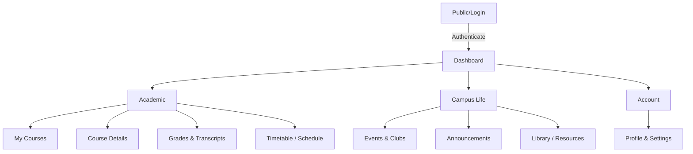

# StudentHub Portal

## 1. Problem Scope
Students often struggle to find academic and extracurricular resources in one place. Information is typically scattered across multiple discordant systems, leading to missed deadlines, poor communication between faculty and students, and low engagement with campus activities. The StudentHub portal aims to solve this fragmented experience by providing a centralized platform where students can seamlessly access their timetables, grades, club activities, library resources, and communicate with peers and faculty.

## 2. User Roles
* **Student:** Can view grades, check timetables, register for events, and access course materials.
* **Faculty:** Can post announcements, upload course materials, manage class lists, and publish grades.
* **Club Coordinator:** Can create and manage extracurricular events, and oversee club memberships.
* **Administrator:** Can manage system-wide settings, user roles, and access permissions.

## 3. Key Modules
* **Authentication & Authorization:** Secure login and role-based access control.
* **Academic Dashboard:** Overview of GPA, current courses, and upcoming deadlines.
* **Course Management:** Repository for syllabus, assignments, and lecture materials.
* **Schedule & Timetable:** Interactive calendar showing classes and exams.
* **Extracurricular & Events:** Noticeboard for club activities, workshops, and sports.
* **Profile & Settings:** User profile customization and notification preferences.

## 4. Navigation Flow
* `Login Page` -> Validates credentials.
* On success, routes to `Role-based Dashboard` (e.g., Student Dashboard).
* `Dashboard` provides high-level metrics and notifications.
* The main navigation (sidebar/navbar) routes users to individual modules (`Courses`, `Timetable`, `Grades`, `Events`, `Profile`).

## 5. Minimum 10 Pages Identified
1. **Login Page:** Entry point for all users.
2. **Dashboard (Home):** At-a-glance view of important academic info and alerts.
3. **My Courses:** List of currently enrolled courses.
4. **Course Details:** Specific page for a course with materials and syllabus.
5. **Timetable / Schedule:** Weekly or chronological view of classes.
6. **Grades & Transcripts:** Detailed breakdown of academic performance.
7. **Events & Clubs:** A directory of campus activities and event registrations.
8. **Library / Resources:** Repository of digital books, journals, or useful academic links.
9. **Announcements:** Campus-wide or course-specific notices.
10. **Profile & Settings:** Personal information, password changes, and preferences.

## 6. Sitemap



## 7. Project Folder Structure
The implementation uses a standard HTML/CSS/JS frontend structure:

```
StudentHub/
├── README.md               # Project documentation
├── index.html              # Login Page / Entry point
├── pages/                  # Additional HTML pages
│   ├── dashboard.html
│   ├── courses.html
│   ├── course-details.html
│   ├── timetable.html
│   ├── grades.html
│   ├── events.html
│   ├── library.html
│   ├── announcements.html
│   └── profile.html
├── assets/                 # Static assets
│   ├── css/
│   │   ├── style.css       # Main stylesheet
│   │   └── components.css  # Component-specific styles
│   ├── js/
│   │   ├── main.js         # Core functionality
│   │   └── auth.js         # Authentication logic
│   └── images/             # Visual assets
└── docs/                   # Wireframes and extra documentation
    └── wireframes/
```
